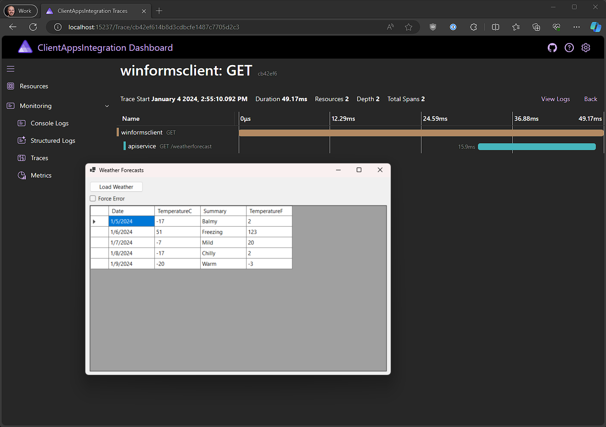

---
languages:
- csharp
products:
- dotnet
- dotnet-aspire
page_type: sample
name: ".NET Aspire Client Apps Integration"
urlFragment: "aspire-client-apps-integration"
description: "An example of working with client apps (WinForms, WPF, etc.) in a .NET Aspire app."
---

# Working with client apps in a .NET Aspire application

This sample demonstrates working with client apps such as WinForms, WPF, etc., in a .NET Aspire app, such that the client app is launched along with the AppHost project, can resolve services via service discovery, and logs, traces, and metrics via OpenTelemetry to the dashboard.

The app is based on the Aspire Starter App template, with the following additional elements:

- **ClientAppsIntegration.WinForms**: This is a WinForms application that displays the results of calling the weather API service application.
- **ClientAppsIntegration.WPF**: This is a WPF application that displays the results of calling the weather API service application.
- **ClientAppsIntegration.AppDefaults**: This is a class library that defines the default configuration for orchestrated apps. It's a more general version of the typical `ServiceDefaults` class library that's included in Aspire apps. The `ClientAppsIntegration.WinForms` and `ClientAppsIntegration.WPF` projects reference this project and calls its `AddAppDefaults()` method.
- **ClientAppsIntegration.ServiceDefaults**: This has been modified from the default `ServiceDefaults` template to be based on and extend the `ClientAppsIntegration.AppDefaults` class library. The `ClientAppsIntegration.ApiService` project references this project and calls its `AddServiceDefaults()` method.

## Pre-requisites

- A Windows OS supported by .NET 8 (e.g. Windows 10/11)
- [.NET 8 SDK](https://dotnet.microsoft.com/download/dotnet/8.0)
- [Visual Studio 2022 17.9 Preview](https://visualstudio.microsoft.com/vs/preview/)

## Running the app

Using Visual Studio, open the solution file `ClientAppsIntegration.sln` and launch/debug the `ClientAppsIntegration.AppHost` project.

In the launched WinForms and WPF app, click on "Load Weather" button to have the app call the backend weather API and populate the grid with the results. To explore the error condition behavior, check the "Force Error" checkbox and click on the "Load Weather" button again.

In the Aspire dashboard, use the logs, traces, and metrics pages to see telemtry emitted from the client apps.