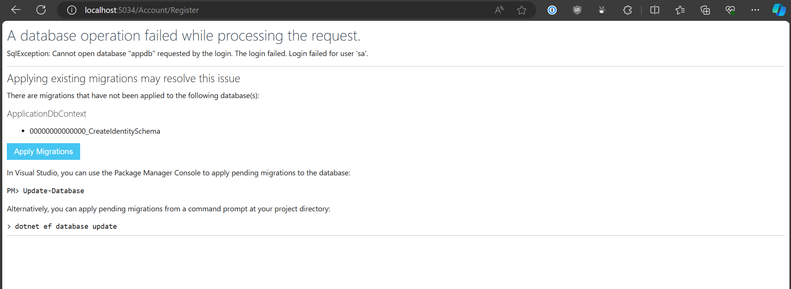
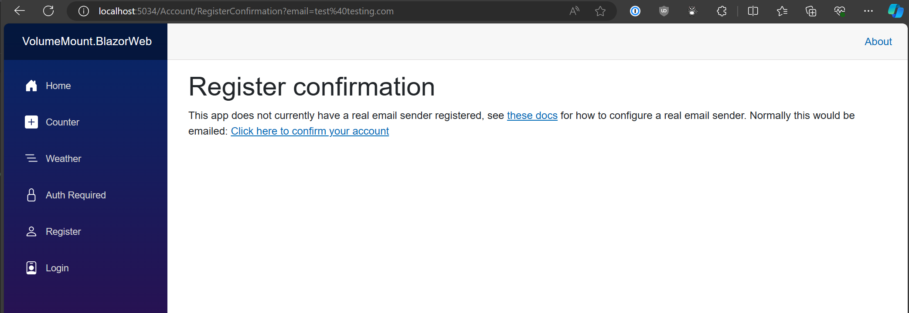
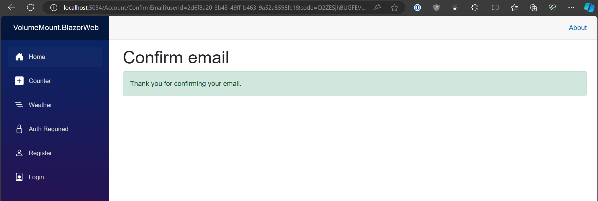

---
languages:
- csharp
products:
- dotnet
- dotnet-aspire
page_type: sample
name: ".NET Aspire persistent volume mount sample"
urlFragment: "aspire-volume-mount"
description: "An example demonstrating how to configure a local SQL Server container to use a persistent volume mount in .NET Aspire."
---

# Persistent Volume Mount

This sample demonstrates how to configure a SQL Server container to use a persistent volume mount in .NET Aspire, so that the data is persisted across app launches. This method can be used to persist data across instances of other container types configured in .NET Aspire apps too, e.g. PostgreSQL, Redis, etc.

The app consists of a single service, **VolumeMount.BlazorWeb**, that is configured with a SQL Server container instance via the AppHost project. This Blazor Web app has been setup to use ASP.NET Core Identity for local user account registration and authentication, including the new [Blazor identity UI](https://devblogs.microsoft.com/dotnet/whats-new-with-identity-in-dotnet-8/#the-blazor-identity-ui). Using a persistent volume mount means that user accounts created when running locally are persisted across launches of the app.


The app also includes a standard class library project, **VolumeMount.ServiceDefaults**, that contains the service defaults used by the service project.

## Pre-requisites

- [.NET 8 SDK](https://dotnet.microsoft.com/download/dotnet/8.0)
- [Docker Desktop](https://www.docker.com/products/docker-desktop/)
- **Optional** [Visual Studio 2022 17.9 Preview](https://visualstudio.microsoft.com/vs/preview/)

## Running the app

1. If using Visual Studio, open the solution file `VolumeMount.sln` and launch/debug the `VolumeMount.AppHost` project.

    If using the .NET CLI, run `dotnet run` from the `VolumeMount.AppHost` directory.

1. The first time you run the app, you'll receieve an error indicating that a password for the SQL Server container has not been configured. To configure a password, set the `sqlpassword` key in the User Secrets store of the `VolumeMount.AppHost` project using the `dotnet user-secrets` command in the AppHost project directory:

    ```
    dotnet user-secrets set sqlpassword <password>
    ```

    A stable password is required when using a persistent volume mount for SQL Server data, rather than the default auto-generated password.

1. Once a password is configured, run the `VolumeMount.AppHost` project again and navigate to the URL for the `VolumeMount.BlazorWeb` from the dashboard.

1. From the home page, click the "Register" link and enter a email and password to create a local user:

    

1. After a short while (30-60s) an error page will be displayed stating that the database is not initialized and suggesting that EF Core migration be run. Click the "Apply Migrations" button and once the button text changes to "Migrations Applied", refresh the browser and confirm the form resubmission when prompted by the browser:

    

1. A page will be shown confirming the registration of the account and a message detailing that a real email sender is not registered. Find and click the link at the end of the message to confirm the created account:

    

1. Verify that the email confirmation page is displayed, indicating that the account is now registered and can be used to login to the site, and then click on the "Login" link in the left-hand navigation menu:

    

1. Enter the email and password you used in the account registration page to login:

    

1. Once logged in, click the "Logout" link in the left-hand navigation menu to log out of the site, and then stop the app, followed by starting it again, and verifying that the account you just created can still be used to login to the site once restarted, indicating that the database was using the persistent volume to store the data. You can verify the named volume existance using the Docker CLI too (`docker volume ls`):

    ```
    > docker volume ls -f name=sqlserver
    DRIVER    VOLUME NAME
    local     VolumeMount.sqlserver.data
    ```